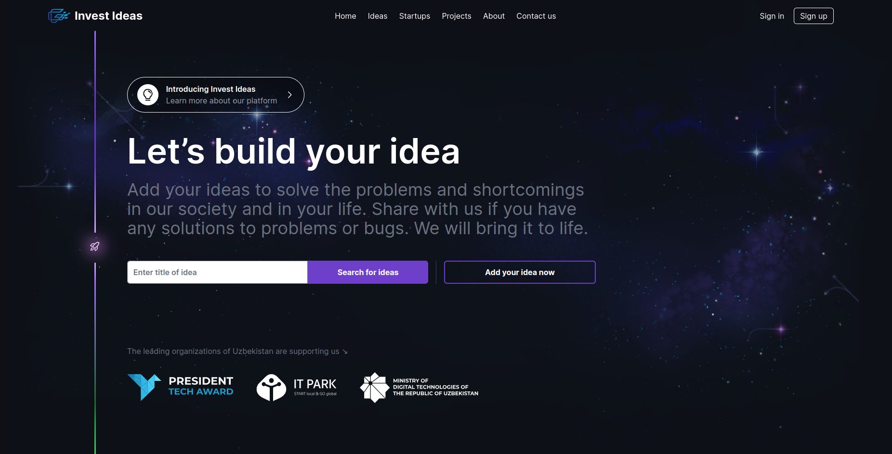
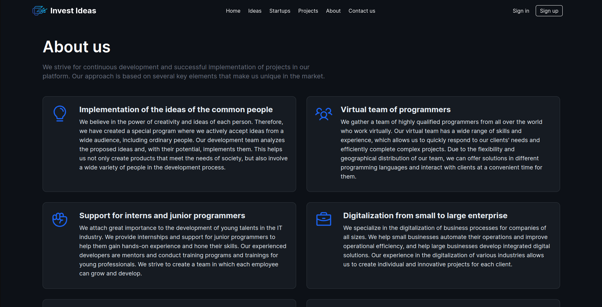

## [InvestIdeas.uz](http://investideas.uz)
# The Platform intended to release different ideas

___"InvestIdeas"___ is a revolutionary platform designed to empower individuals and organizations by bridging the gap between ideation and digitalization. It addresses the pressing issue of manual and non-automated processes by providing a space where anyone can submit ideas, share problems that require automation, and transform them into actionable projects.

** Key Features: **

- ***Idea Submission:*** Users can submit their ideas, concepts, or problems they believe could benefit from automation and digitalization. The platform encourages creativity and innovation by offering a user-friendly idea submission interface.

- ***Idea Collaboration:*** Once an idea is submitted, it becomes accessible to a community of programmers and tech enthusiasts. These users can browse through the ideas and express their interest in contributing to the solution.

- ***Task Assignment:*** Through a transparent and collaborative process, the platform enables project managers to assign tasks and responsibilities to programmers. Task assignments are based on the skills and expertise of the users, creating a harmonious collaboration environment.

- ***Work Management:*** The platform features a project management dashboard where tasks are tracked, deadlines are set, and progress is monitored. This ensures that projects move forward efficiently and that contributors stay engaged and motivated.

- ***Payment Mechanism:*** To incentivize contributors, the platform offers a built-in payment system. Upon successful completion of assigned tasks, programmers receive compensation based on predefined rates or agreements. This encourages active participation and fosters a sense of community and fairness.

- ***Digitalization Resources:*** "Idea-2-Digital" provides access to a library of resources, such as guides, tutorials, and tools, to assist programmers in the digitalization process. This empowers users with the knowledge and skills necessary to bring ideas to life.

- ***Feedback and Evaluation:*** Users can provide feedback and rate the contributions of programmers, fostering a culture of continuous improvement and accountability.

- ***Community Support:*** A vibrant community forum allows users to discuss ideas, share experiences, and seek advice from fellow community members. This forum not only builds a sense of camaraderie but also enhances the overall platform experience.

- ***Security and Data Privacy:*** The platform takes data security and user privacy seriously, implementing robust security measures to protect sensitive information and maintain user trust.

___"InvestIdeas"___ is more than just a platform; it's a community-driven ecosystem for innovation, problem-solving, and collaboration. It aims to accelerate the automation and digitalization of manual processes, making technology accessible to all and turning ideas into reality. Join us in this exciting journey of transformation and be a part of a global community of innovators and problem-solvers.

## To add your Idea just need to:
* Sign Up
* Leave description of your Idea
* **That's it, we will contact with you in several hours** 

